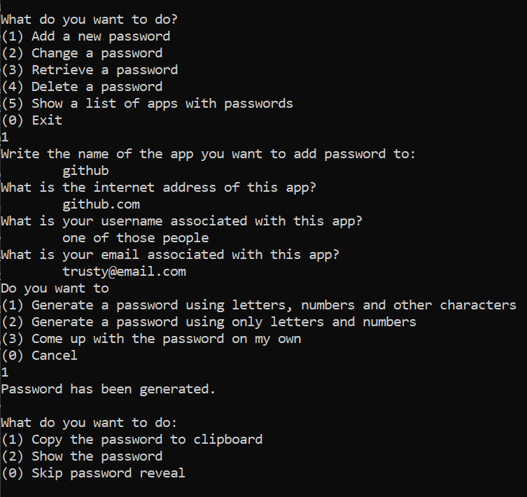

<!-- inspired by github.com/KalleHallden/pwManager -->

A console application to manage a local database of passwords.

The way to encrypt/decrypt the data was taken from an example in the documentation of the cryptography library.

To start the password manager, just use command
`python pm.py`

### Libraries/modules used:
* cryptography
* argo2-cffi
* pyperclip
* pytest 
<!-- * base64
* getpass
* sqlite3
* os -->

More detailed requirements can be found in requirements.txt.

### Possible improvements
* Encryption/decryption/hashing can most likely be improved
* Replacing 'input' with something else
* Everyone wants a fancy GUI...
